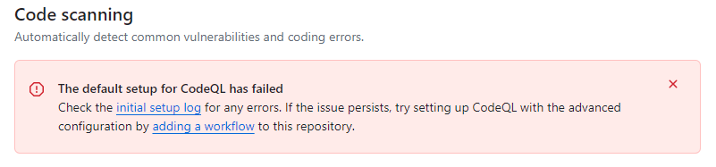

# Code Scanning

GitHub Code Scanning is a security feature designed to identify and report security vulnerabilities in the codebase. The process runs on every commit and pull request. GitHub Code Scanning is enabled by default for all repositories within the Allianz GitHub organization.

GitHub Code Scanning utilizes the code analysis engine CodeQL. The supported languages are:

* C/C++
* C#
* Go
* Java/Kotlin
* JavaScript/TypeScript
* Python
* Ruby
* Swift

Compiled languages must be built during the analysis process. In many cases, no configuration is required. However, in some cases, a custom configuration might be necessary. In such a case, GitHub will display an error message and provide guidance through the necessary steps.

 